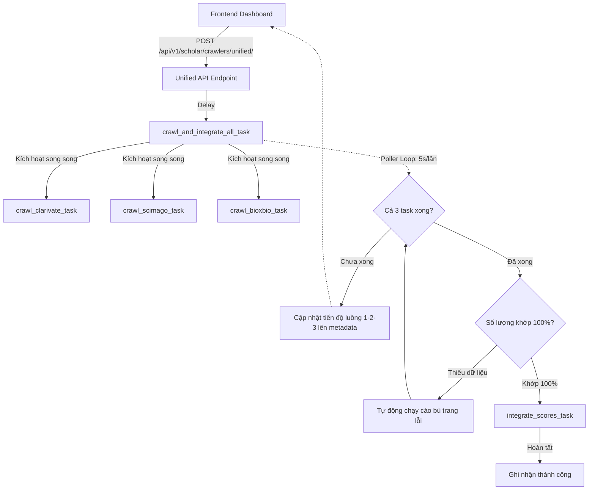

# 🎓 Unified Parallel Academic Scraper & Matcher - Giao diện & Điều phối tổng hợp

Tài liệu Đặc tả Thiết kế (Design Spec) này mô tả chi tiết giải pháp xây dựng công cụ cào và đồng bộ dữ liệu song song (Parallel & Self-Healing Crawler) chạy trong môi trường Web (Django + Celery + React).

---

## 1. Mục tiêu (Goals)
* **Tích hợp đồng bộ:** Gom 4 tiến trình cào và mapping riêng biệt (Clarivate, SCImago, BioxBio, Score Integrator) vào một nút nhấn duy nhất trên Web Dashboard của Admin.
* **Tối ưu tốc độ:** Chạy song song 3 công cụ cào dữ liệu thô (Clarivate, SCImago, BioxBio) cùng một lúc.
* **An toàn cho IP:** Áp dụng cơ chế dừng ngẫu nhiên (Random Jitter) mô phỏng người dùng thật và ngắt mạch (Circuit Breaker) khi bị rate limit để tránh bị chặn IP.
* **Cào sạch 100% (Self-Healing):** Đối chiếu số lượng thực tế sau khi cào và tự động cào bù các trang lỗi cho đến khi khớp hoàn toàn số lượng của nguồn.
* **Thông minh và Đa năng:** Tự động điều hướng và trích xuất link thông minh từ trang thư mục chính `https://www.bioxbio.com/journal/`.

---

## 2. Thiết kế Cơ sở Dữ liệu (Database Schema)
Hệ thống sử dụng các Model hiện có trong Django (`apps/scholar/models.py`):
1. **ClarivateJournal & ClarivateCrawlerProgress:** Lưu trữ danh mục mốc chuẩn Clarivate (WoS Core).
2. **ScimagoJournal, ScimagoISSN & ScimagoRanking:** Lưu dữ liệu xếp hạng SJR Q1-Q4 qua các năm.
3. **BioxbioJournal, BioxbioISSN, BioxbioRanking & BioxbioCrawlerProgress:** Lưu chỉ số Impact Factor (IF) từ BioxBio.
4. **Journal, JournalISSN & JournalRanking:** Danh mục tạp chí tích hợp cuối cùng sau khi chạy Mapping.

---

## 3. Kiến trúc Điều phối Backend (Django + Celery)

Hệ thống sẽ chạy theo mô hình **Coordinator Poller Task** (Phương án A):



### 3.1. API View & Serializer
* Thêm `UnifiedCrawlRequestSerializer` trong `serializers.py`:
  ```python
  class UnifiedCrawlRequestSerializer(serializers.Serializer):
      scimago_years = serializers.ListField(child=serializers.IntegerField(), required=False, allow_null=True)
      clarivate_max_pages = serializers.IntegerField(required=False, allow_null=True)
      max_workers = serializers.IntegerField(default=5, min_value=1, max_value=30)
      delay = serializers.FloatField(default=1.5, min_value=0.1, max_value=10.0)
  ```
* Đăng ký action `@action(detail=False, methods=["post"], url_path="unified")` trong `CrawlerViewSet` (`apps/scholar/api/views.py`) để kích hoạt task `crawl_and_integrate_all_task`.

### 3.2. Task Điều phối chính (`crawl_and_integrate_all_task`)
* Chấp nhận các cấu hình cho 3 crawler.
* Kích hoạt đồng thời 3 task cào bằng lệnh `.delay()`.
* Chạy vòng lặp giám sát (Poller Loop) truy vấn `AsyncResult` sau mỗi 5 giây.
* Tính toán tiến độ tổng hợp (Average progress of crawlers = 0% - 75%).
* Khi 3 task cào báo thành công, tiến hành kiểm tra đếm số lượng bản ghi thực tế trong DB:
  * Nếu đếm số lượng trong `ClarivateJournal` < `totalRecords` từ Clarivate API, tự động kích hoạt cào lại các trang lỗi.
  * Nếu đếm số lượng `BioxbioJournal` thiếu so với các trang cào của chuyên mục, tiến hành cào bù trang bị sót.
* Khi dữ liệu đã khớp hoàn toàn, kích hoạt `integrate_scores_task` (Mapping) để hoàn tất giai đoạn 2 (75% - 100%).

---

## 4. Thuật toán Cào Thông Minh & An toàn IP (Scraper Logic)

### 4.1. An toàn IP (Human-like Jitter & Circuit Breaker)
* **Random Jitter:** Trong các thread tải chi tiết của BioxBio và Clarivate, chèn khoảng nghỉ:
  ```python
  import random
  time.sleep(random.uniform(0.5, 1.5))
  ```
* **Circuit Breaker:** Khi gặp lỗi `429` hoặc `403` do bị rate limit, luồng con sẽ ghi nhận cờ dừng khẩn cấp. Toàn bộ các luồng con sẽ ngưng cào (Sleep) trong 30 giây, giải phóng tài nguyên và tự động quay vòng Proxy mới rồi mới thử lại.

### 4.2. Cơ chế Tự điều hướng thông minh BioxBio (Smart BioxBio Navigation)
* Khi `start_url` là `https://www.bioxbio.com/journal/`, BioxBio crawler sẽ phân tích cấu trúc DOM để trích xuất danh sách các trang phân trang (Pagination links) và các chỉ mục chữ cái (Alphabet index từ A-Z).
* Tự động thêm các trang này vào hàng đợi cào mà không cần Admin phải nhập thủ công từng chuyên mục.
* Cào sâu chính xác cấu trúc HTML bằng `BeautifulSoup` để bóc tách ISSN, điểm Impact Factor qua từng năm mà không sinh dữ liệu ảo (Không bịa dữ liệu).

---

## 5. Thiết kế Giao diện (React Frontend)

Chúng ta sẽ xây dựng trang **`UnifiedCrawlerPage.tsx`** tại `frontend/src/pages/` và đăng ký trong `routes.tsx` và `Sidebar.tsx`.

### 5.1. Các thành phần UI chính:
1. **Bảng Điều khiển Cấu hình:**
   * Cho phép chỉnh sửa số luồng (workers), thời gian trễ (delay) cho từng crawler riêng biệt.
   * Chọn danh sách năm cho SCImago (mặc định trống = cào tất cả).
2. **Thanh tiến trình tổng hợp (Master Progress):**
   * Hiển thị trạng thái chung của toàn bộ pipeline cào và mapping.
3. **Màn hình Tiến độ Song song (Parallel Progress View):**
   * Hiển thị 3 thẻ song song (Clarivate, SCImago, BioxBio) với trạng thái, tỷ lệ phần trăm cào thực tế và mô tả hoạt động của từng luồng.
   * Thẻ Mapping ở dưới hiển thị trạng thái chờ cào hoàn tất.
4. **Màn hình Console Log:**
   * Log trực tiếp tiến trình từ server được phân loại rõ ràng (ví dụ: `[CLARIVATE]`, `[SCIMAGO]`, `[BIOXBIO]`, `[MAPPING]`).
5. **Nút bấm Hành động:**
   * Nút **Khởi chạy hệ thống** (🚀 Bắt đầu cào song song) và nút **Dừng khẩn cấp** (🛑 Dừng cào).

---

## 6. Chiến lực Kiểm thử (Testing Strategy)
* **Kiểm thử Từng phần (Unit Tests):** Đảm bảo hàm tự điều hướng thông minh hoạt động tốt trên link `https://www.bioxbio.com/journal/` và trích xuất đúng danh sách trang con.
* **Kiểm thử Tích hợp (Integration Tests):** Mô phỏng luồng chạy song song trong Celery, giả lập trường hợp 1 luồng cào bị lỗi trang giữa chừng để xác nhận cơ chế cào bù (Self-Healing Loop) hoạt động chính xác và lặp cào cho đến khi đủ số lượng.
* **Kiểm thử Vượt rào bảo mật (IP Block Simulation):** Tạo mock status code `429` để kiểm tra cơ chế ngắt mạch tạm dừng 30 giây của các worker con.
