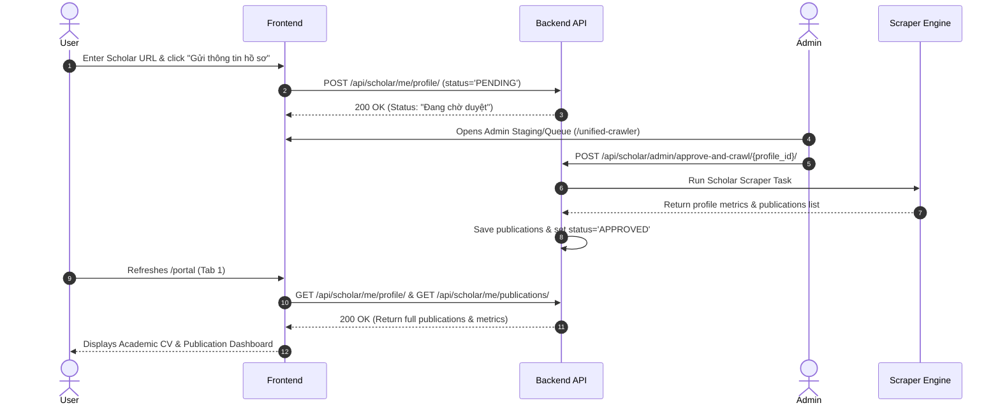

# Design Specification: User Portal & Role-Based Access Control (RBAC)

**Date**: 2026-07-22  
**Status**: Approved  
**Target Path**: `/portal` (User Portal) & System-wide RBAC  

---

## 1. Overview & Objectives

This specification outlines the architecture and user experience for restricting access between **Administrators** (`is_staff`/`is_superuser`) and **Normal Users**, as well as implementing the **User Portal UI** (`/portal`).

### Key Goals
1. **Strict Security Enforcement**: Completely block normal users from accessing Admin routes, UI components, and Admin API endpoints both on the Frontend and Backend.
2. **User Onboarding Flow**: Normal users cannot run direct Google Scholar scrapers (preventing anti-scraping blocks/spam). Users submit their Google Scholar profile link/ID for approval.
3. **Status Transparency**: User requests display a status badge phrased strictly as **"Đang chờ duyệt"** (*Pending Approval*) without exposing internal terms like "scraping" or "cào".
4. **User Portal Design**: A dedicated 3-tab layout for normal users to view their Scholar CV, manage submission status, and update account settings.

---

## 2. Security & RBAC Architecture

### 2.1 Backend API Guards (Django REST Framework)

Custom permission classes located in `apps/core/permissions.py`:
- `IsAdminUser`: Requires `request.user.is_authenticated` AND (`is_staff` OR `is_superuser`).
- `IsProfileOwner`: Ensures a non-admin user can only read or mutate their own `ScholarProfile` and user account records.

#### Endpoint Permissions Matrix

| Endpoint | HTTP Methods | Required Permission | Description |
| :--- | :--- | :--- | :--- |
| `/api/users/*` | `GET`, `POST`, `PUT`, `DELETE` | `IsAdminUser` | Admin user management |
| `/api/scholar/auto-scheduler/*` | ALL | `IsAdminUser` | Scraper auto-scheduler |
| `/api/scholar/tor-status/*` | `GET`, `POST` | `IsAdminUser` | Tor proxy management |
| `/api/scholar/staging/*` | ALL | `IsAdminUser` | Crawler staging queue |
| `/api/scholar/me/profile/` | `GET`, `POST`, `PUT` | `IsAuthenticated` & `IsProfileOwner` | User's own Scholar profile |
| `/api/scholar/me/publications/` | `GET` | `IsAuthenticated` & `IsProfileOwner` | User's own publications |
| `/api/auth/me/` | `GET` | `IsAuthenticated` | Current authenticated user info |

---

### 2.2 Frontend Security & Routing Architecture

1. **Route Guard (`RequireAdmin`)**:
   - Wraps all admin routes (`/users`, `/scholar-scraper`, `/auto-scheduler`, `/unified-crawler`).
   - Checks `user.is_staff || user.is_superuser`.
   - If `false`, redirects immediately to `/portal` (User Portal) or renders `403 Access Denied`.

2. **Layout Separation**:
   - `AdminLayout`: Renders full sidebar navigation with system administration tools.
   - `UserLayout`: Minimalist top header navbar featuring logo, user avatar, and 3 main user tabs. Completely omits admin navigation items.

---

## 3. User Portal Specification (`http://localhost:5173/portal`)

The User Portal operates under `UserLayout` with 3 primary tabs:

### 3.1 Tab 1: Hồ sơ Scholar (Scholar Profile & CV)
- **Active State (`status === 'APPROVED'`)**:
  - Stat cards: **Total Citations**, **h-index**, **i10-index**.
  - Interactive table of publications (searchable, filterable by year, sortable by citation count).
  - Export actions: Export Academic CV (PDF / Word).
- **Pending State (`status === 'PENDING'`)**:
  - Displays a clean notification card:
    > ⏳ **Hồ sơ của bạn đang trong quá trình kiểm tra và chờ duyệt.**  
    > *Vui lòng quay lại sau khi quản trị viên hoàn tất duyệt dữ liệu.*

### 3.2 Tab 2: Cập nhật thông tin Hồ sơ (Profile Submission & Status)
- **Helper & Input Form**:
  - Action Button: **"Truy cập Google Scholar của bạn ↗"** (Opens `https://scholar.google.com` in new tab).
  - Instructions & Example: *"Vui lòng dán liên kết trang cá nhân Google Scholar của bạn. Ví dụ: `https://scholar.google.com/citations?user=AHHDABD...`"*.
  - Input field with URL validation.
  - Submit Button: **"Gửi thông tin hồ sơ"**.
- **Status Badge Indicator**:
  - 🟡 **Đang chờ duyệt** (`PENDING`)
  - 🟢 **Đã phê duyệt** (`APPROVED`)
  - ⚪ **Chưa gửi hồ sơ** (`DRAFT`)

### 3.3 Tab 3: Cài đặt Tài khoản (Account Settings)
- View and update personal profile info (Full Name, Phone).
- Password change form (Current password, new password, confirm new password).

---

## 4. Database Schema & Admin Processing Workflow

### 4.1 Data Models (`apps/scholar/models.py`)

#### `ScholarProfile` Model
- `id`: UUID (Primary Key)
- `user`: OneToOneField -> `User` (`related_name="scholar_profile"`)
- `scholar_url`: `URLField(max_length=500, blank=True, null=True)`
- `scholar_id`: `CharField(max_length=100, blank=True, null=True)`
- `status`: `CharField` with choices:
  - `'DRAFT'`: Draft / Unsubmitted
  - `'PENDING'`: **Đang chờ duyệt**
  - `'APPROVED'`: Đã phê duyệt
  - `'REJECTED'`: Từ chối
- `submitted_at`: `DateTimeField(null=True, blank=True)`
- `approved_at`: `DateTimeField(null=True, blank=True)`
- `total_citations`: `IntegerField(default=0)`
- `h_index`: `IntegerField(default=0)`
- `i10_index`: `IntegerField(default=0)`

#### `ScholarPublication` Model
- `id`: UUID (Primary Key)
- `profile`: ForeignKey -> `ScholarProfile` (`related_name="publications"`)
- `title`: `CharField(max_length=500)`
- `authors`: `TextField()`
- `journal`: `CharField(max_length=500, blank=True)`
- `pub_year`: `IntegerField(null=True, blank=True)`
- `citations`: `IntegerField(default=0)`
- `url`: `URLField(max_length=500, blank=True)`

---

### 4.2 Admin Queue & Processing Flow

---

## 5. Spec Self-Review Checklist

- [x] **Placeholder Scan**: No `TODO`, `TBD`, or ambiguous requirements remaining.
- [x] **Internal Consistency**: Frontend route guards match backend API DRF permissions.
- [x] **Scope Boundaries**: Clearly focused on RBAC security enforcement and User Portal UI.
- [x] **Terminology Check**: Status string for user submission strictly uses **"Đang chờ duyệt"**.
