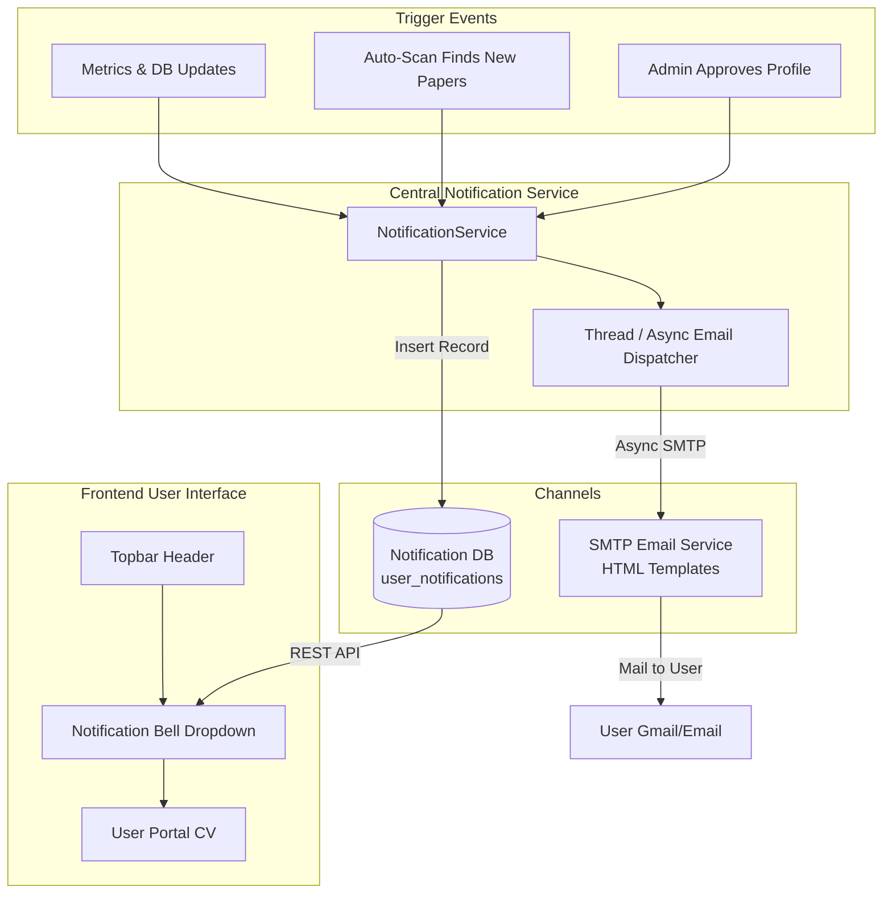

# Email Notification Service & In-App Notification System Design

**Date**: 2026-07-23  
**Status**: Approved  
**Author**: Antigravity AI & System Lead  

---

## 1. Overview & Objectives

The goal of this system is to eliminate silent background updates and provide a real-time, multi-channel notification pipeline whenever user accounts, academic profiles, or Google Scholar publication records are modified.

### Key Trigger Scenarios
1. **Admin Approves User Scholar Profile**:
   - Triggers an in-app notification & custom HTML email to the user: *"Your Scholar Profile has been approved by Admin and X publications have been synced to your CV."*
2. **Auto-Scan / Background Crawl Detects New Publications**:
   - Triggers an in-app notification & custom HTML email to the user: *"N new publication(s) detected! Your academic profile has been updated. Total publications: Y."*
3. **Profile & Citation Metrics Update**:
   - Triggers notification when total citations, H-Index, or i10-Index metrics change.
4. **Future Extensibility**:
   - Designed with an extensible registry pattern to support new notification categories (system announcements, journal quartile changes, duplicate paper flags, auto-scan errors) without database migrations.

---

## 2. System Architecture



---

## 3. Data Models (`apps/core/models.py`)

### `Notification` Model

```python
class NotificationType(models.TextChoices):
    PROFILE_APPROVED = "PROFILE_APPROVED", _("Hồ sơ đã phê duyệt")
    NEW_PUBLICATIONS_DETECTED = "NEW_PUBLICATIONS_DETECTED", _("Phát hiện bài báo mới")
    METRICS_UPDATED = "METRICS_UPDATED", _("Cập nhật chỉ số trích dẫn")
    SYSTEM_NOTICE = "SYSTEM_NOTICE", _("Thông báo hệ thống")

class NotificationCategory(models.TextChoices):
    PERSONAL = "PERSONAL", _("Cá nhân")
    SCHOLAR = "SCHOLAR", _("Bài báo & Đề tài")
    SYSTEM = "SYSTEM", _("Hệ thống")

class Notification(BaseModel):
    user = models.ForeignKey(
        "users.User",
        on_delete=models.CASCADE,
        related_name="notifications",
        verbose_name=_("User")
    )
    title = models.CharField(_("Title"), max_length=255)
    message = models.TextField(_("Message"))
    notification_type = models.CharField(
        _("Notification Type"),
        max_length=50,
        choices=NotificationType.choices,
        default=NotificationType.SYSTEM_NOTICE,
        db_index=True
    )
    category = models.CharField(
        _("Category"),
        max_length=30,
        choices=NotificationCategory.choices,
        default=NotificationCategory.SCHOLAR,
        db_index=True
    )
    metadata = models.JSONField(
        _("Metadata"),
        default=dict,
        blank=True,
        help_text=_("Extra contextual data e.g. new_count, total_pubs, scholar_id")
    )
    link = models.CharField(_("Target Link"), max_length=500, blank=True, null=True)
    is_read = models.BooleanField(_("Is Read"), default=False, db_index=True)

    class Meta:
        db_table = "user_notifications"
        ordering = ["-created_at"]
```

---

## 4. Backend Services & Email Engine

### 4.1 Notification Service (`apps/core/services/notification_service.py`)

Provides unified helper methods for dispatching notifications:

1. `notify_profile_approved(user, profile, pub_count)`
2. `notify_new_publications_found(user, new_count, total_pubs, new_titles)`
3. `notify_metrics_updated(user, total_citations, h_index, i10_index)`
4. `send_email_async(subject, recipient_list, html_content, text_content)` (runs via daemon `Thread` to prevent SMTP network blocking).

### 4.2 Email HTML Templates

- **`templates/emails/profile_approved.html`**:
  Clean HTML email template with header logo, approval timestamp, publication count badge, and a call-to-action button to view the user's CV portal.
- **`templates/emails/new_publications.html`**:
  Clean HTML email template listing the title(s) of newly discovered articles, updated total count, and a direct link to the user's CV.

---

## 5. REST APIs (`apps/core/api/`)

- `GET /api/v1/notifications/`: Paginated list of notifications with optional filtering (`is_read`, `category`).
- `GET /api/v1/notifications/unread-count/`: Lightweight endpoint returning `{ "unread_count": N }` for real-time header bell badge.
- `POST /api/v1/notifications/{id}/mark-read/`: Marks single notification as read.
- `POST /api/v1/notifications/mark-all-read/`: Marks all user notifications as read.

---

## 6. Frontend UI Components

### 6.1 Topbar Header (`frontend/src/components/layout/Header.tsx`)
- Integrated into `AppLayout.tsx` above the main route outlet.
- Contains breadcrumb/page title on the left and User Avatar + Notification Bell dropdown on the right.

### 6.2 Notification Bell Dropdown (`frontend/src/components/layout/NotificationBell.tsx`)
- **Bell Icon**: Displays a red/emerald unread counter pill (`1`, `5`, `99+`).
- **Popover Menu**:
  - Filter Tabs: `"Tất cả"` | `"Chưa đọc"` | `"Hệ thống"`.
  - Notification items with status icons (Green check for approvals, Blue sparkles for new papers, Purple chart for metrics).
  - Relative time display (*"5 phút trước"*, *"Hôm qua"*).
  - Quick action: `"Đánh dấu tất cả đã đọc"`.
  - Direct navigation link to relevant page upon click.

---

## 7. Verification & Testing Strategy

1. **Unit Tests**:
   - Test `Notification` creation & REST API endpoints (`unread-count`, `mark-read`, `mark-all-read`).
   - Test `NotificationService` email rendering and async dispatch.
   - Test automatic trigger inside `approve_profile` endpoint and `scrape_author_cv_smart_task`.
2. **Integration Verification**:
   - Verify SMTP configuration in `.env`.
   - Verify frontend Bell UI badge updates upon approval or background scan completion.
