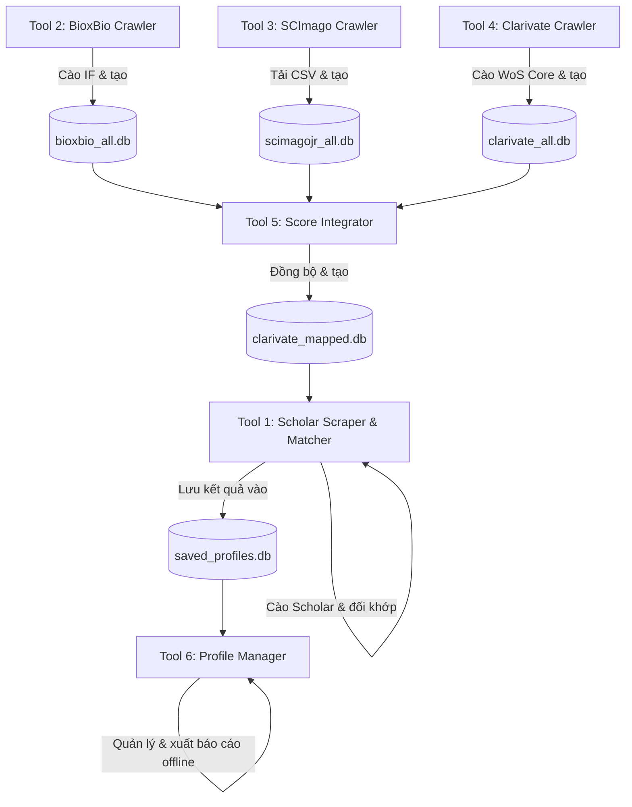

# 🎓 Scholar Matcher Desktop App - Tài liệu Đặc tả Hệ thống

Tài liệu này mô tả chi tiết kiến trúc, chức năng hệ thống, chi tiết 6 công cụ (tool), thiết kế cơ sở dữ liệu (Database Schema), luồng chạy dữ liệu và thuật toán so khớp (mapping) học thuật của ứng dụng **Scholar Matcher Desktop App**.

---

## 1. Giới thiệu tổng quan hệ thống

**Scholar Matcher Desktop App** là một giải pháp phần mềm chạy trên nền tảng Desktop (Python & CustomTkinter) giúp các nhà nghiên cứu, phòng quản lý khoa học hoặc các trường đại học tự động hóa việc thu thập, phân tích và quản lý hồ sơ khoa học của các tác giả. 

Hệ thống giải quyết vấn đề tốn thời gian và dễ sai sót khi đối khớp thủ công danh sách bài báo của một tác giả với phân hạng của các tạp chí quốc tế thuộc danh mục uy tín như **Web of Science (WoS Core)**, xếp hạng **SJR (SCImago Quartile Q1-Q4)** và chỉ số ảnh hưởng **Impact Factor (IF)**.

### Các công nghệ cốt lõi sử dụng:
*   **Ngôn ngữ lập trình:** Python 3
*   **Giao diện người dùng (GUI):** CustomTkinter (Thư viện UI hiện đại phát triển dựa trên Tkinter của Python với khả năng tùy biến giao diện tối tối giản, hỗ trợ Dark Mode và các hiệu ứng động mượt mà).
*   **Thu thập dữ liệu (Scraping/Crawling):** Thư viện `scholarly` (lõi cào dữ liệu Google Scholar), `Selenium WebDriver` (giả lập trình duyệt Chrome để vượt Cloudflare/CAPTCHA), và `requests` (cào dữ liệu REST API hoặc HTTP thô).
*   **Cơ sở dữ liệu:** SQLite (Hệ quản trị cơ sở dữ liệu nhúng nhẹ, không cần cài đặt server, lưu trữ toàn bộ dữ liệu cào và đồng bộ dưới dạng các tệp tin `.db` cục bộ).
*   **Xử lý dữ liệu:** `Pandas` (phân tích file CSV lớn), `OpenPyXL` (xuất file Excel chất lượng cao).

---

## 2. Các chức năng chính của hệ thống

1.  **Thu thập dữ liệu tác giả học thuật:** Cào tự động thông tin tác giả (H-index, i10-index, số trích dẫn, lĩnh vực nghiên cứu) và danh sách toàn bộ bài báo đã xuất bản từ Google Scholar chỉ thông qua link hồ sơ hoặc từ khóa tìm kiếm tên tác giả.
2.  **Đối khớp phân hạng tự động (Automatic Ranking Matcher):** Tự động đối chiếu thông tin nơi xuất bản (Venue/Journal) của từng bài báo với cơ sở dữ liệu phân hạng để trích xuất điểm số **Impact Factor (IF)**, **SJR Score**, phân hạng **SJR Quartile (Q1 - Q4)**, và xác định xem tạp chí đó có nằm trong lõi **Web of Science Core Collection (SCIE, SSCI, AHCI, ESCI)** hay không.
3.  **Lọc dữ liệu thông minh và Đa chiều:** Lọc danh sách bài báo theo từ khóa (tên bài, tên tạp chí, tên đồng tác giả), theo khoảng năm xuất bản, theo phân hạng cụ thể (ví dụ: chỉ hiện các bài Q1, hoặc chỉ hiện bài thuộc danh mục SCIE) và giới hạn số lượng bài báo trích dẫn cao nhất (Top 10, Top 25...).
4.  **Trực quan hóa số liệu thống kê (Data Visualization):** Vẽ biểu đồ phân bố bài báo theo năm xuất bản, phân bố tỷ lệ các bài báo theo phân hạng tạp chí (Q1-Q4, SCIE, SSCI...) và biểu đồ lịch sử trích dẫn của tác giả qua các năm.
5.  **Xuất báo cáo khoa học:** Hỗ trợ kết xuất báo cáo nhanh dưới dạng tệp tin Excel (`.xlsx`), CSV (`.csv`) hoặc JSON (`.json`) phục vụ mục đích báo cáo thành tích khoa học hoặc lưu trữ.
6.  **Quản lý hồ sơ Offline (Offline Profile Storage):** Lưu lại thông tin tác giả và danh sách bài báo đã cào và đối khớp vào cơ sở dữ liệu cục bộ để có thể tra cứu nhanh, quản lý và xuất báo cáo bất kỳ lúc nào mà không cần kết nối mạng hay cào lại từ Google Scholar.

---

## 3. Chi tiết 6 công cụ (Tools) và chức năng từng phần

Hệ thống được thiết kế dạng mô-đun hóa với 6 công cụ có giao diện trực quan riêng biệt để thực hiện các nhiệm vụ từ cào dữ liệu thô, chuẩn bị CSDL đối sánh, đến quản lý hồ sơ tác giả.



### 3.1. Tool 1: `scholar_scraper_gui.py` (Giao diện cào Google Scholar & Đối khớp DB)
*   **Vai trò:** Giao diện trung tâm và là công cụ cốt lõi dành cho người dùng cuối.
*   **Chức năng chi tiết:**
    *   **Nhập đầu vào:** Người dùng nhập URL hồ sơ Google Scholar (ví dụ: `https://scholar.google.com/citations?user=...`) hoặc gõ tên tác giả trực tiếp để hệ thống tìm kiếm danh sách ứng viên tác giả và hiển thị hộp thoại cho người dùng chọn chính xác tác giả cần cào.
    *   **Thiết lập Proxy:** Cho phép cấu hình phương thức tránh bị Google chặn IP (Anti-Bot) bằng cách sử dụng **Free Proxies** hoặc **ScraperAPI Key**. Cấu hình số lần thử lại (Retries) và thời gian nghỉ giữa các yêu cầu (Sleep Time).
    *   **Thu thập dữ liệu:** Sử dụng thư viện `scholarly` để cào thông tin cơ bản của tác giả và toàn bộ bài báo.
    *   **Đối khớp phân hạng tạp chí:** Tự động gọi module đối khớp `SQLiteClarivateMappedMatcher` kết nối với cơ sở dữ liệu `clarivate_mapped.db` để tra cứu thông tin phân hạng học thuật của tạp chí/hội nghị tương ứng với bài báo ngay trong quá trình cào.
    *   **Hiển thị & Bộ lọc:** Hiển thị kết quả dưới dạng bảng chi tiết, cho phép lọc nhanh bài viết theo năm, phân hạng, từ khóa hoặc giới hạn số lượng bài báo trích dẫn hàng đầu.
    *   **Xuất & Lưu trữ:** Xuất kết quả đã lọc ra file Excel/CSV/JSON và bấm nút lưu trực tiếp hồ sơ tác giả vào DB quản lý hồ sơ để dùng lại sau này.

### 3.2. Tool 2: `bioxbio_crawler_gui.py` (Giao diện cào và quản lý DB BioxBio - Impact Factor)
*   **Vai trò:** Công cụ xây dựng và cập nhật dữ liệu điểm số **Impact Factor (IF)**.
*   **Chức năng chi tiết:**
    *   Kích hoạt kịch bản cào dữ liệu (`bioxbio_crawler.py`) cào sâu vào trang web **BioxBio.com** (nơi tổng hợp lịch sử Impact Factor của hàng chục nghìn tạp chí khoa học quốc tế).
    *   Sử dụng Selenium để duyệt qua trang danh sách chuyên mục, sau đó dùng luồng xử lý đồng thời (`ThreadPoolExecutor` với Multi-threading) để tải trang chi tiết của từng tạp chí bằng thư viện `requests` nhằm tăng tối đa tốc độ cào dữ liệu.
    *   Trích xuất mã ISSN, eISSN và bảng lịch sử Impact Factor qua các năm của từng tạp chí rồi lưu vào tệp tin SQLite `bioxbio_all.db`.
    *   Hỗ trợ theo dõi tiến trình cào dữ liệu thông qua thanh tiến độ (Progress Bar) và giao diện Console log trực quan. Cho phép tạm dừng (Stop) và tự động khôi phục cào tiếp tục từ vị trí trước đó nhờ bảng lưu tiến độ `subject_progress`.

### 3.3. Tool 3: `scimago_crawler_gui.py` (Giao diện cào và quản lý DB SCImago - Quartile/SJR)
*   **Vai trò:** Công cụ tải và phân tích dữ liệu phân hạng phân vị **SJR (SCImago Journal Rank) Q1 - Q4**.
*   **Chức năng chi tiết:**
    *   Dùng Selenium tự động hóa thao tác truy cập trang chủ **SCImago Journal Rank** (scimagojr.com), gửi tham số năm cần tải (ví dụ: từ 1999 đến nay) và tải xuống trực tiếp tệp tin dữ liệu gốc dưới dạng CSV của từng năm (lưu vào thư mục `scimagojr_downloads`).
    *   Đọc và làm sạch các tệp CSV tải về bằng thư viện `pandas` (xử lý các ký tự đặc biệt, chuẩn hóa tiêu đề cột do định dạng CSV thay đổi qua các năm).
    *   Tách lọc mã ISSN (hỗ trợ các tạp chí có nhiều ISSN khác nhau), thông tin nhà xuất bản, quốc gia, điểm số SJR, chỉ số H-index và phân vị xếp hạng cao nhất (Quartile Q1-Q4) của từng tạp chí theo từng năm rồi ghi vào cơ sở dữ liệu `scimagojr_all.db`.

### 3.4. Tool 4: `clarivate_crawler_gui.py` (Giao diện cào và quản lý DB Web of Science - Clarivate)
*   **Vai trò:** Công cụ xây dựng cơ sở dữ liệu nền tảng chứa danh sách các tạp chí chính thức được Web of Science công nhận.
*   **Chức năng chi tiết:**
    *   Kết nối trực tiếp tới API REST công khai của trang danh mục tạp chí Clarivate Web of Science (`https://mjl.clarivate.com/api/mjl/jprof/public/rank-search`).
    *   Gửi các yêu cầu POST có kèm phân trang (Page Size = 100 tạp chí/trang) cùng các bộ lọc để lấy toàn bộ các tạp chí đã và đang nằm trong danh mục cốt lõi (WoS Core Collection).
    *   Phân tích cấu trúc dữ liệu JSON phản hồi từ API để trích xuất: Tên tạp chí của Clarivate, ISSN, eISSN, tên và địa chỉ nhà xuất bản, quốc gia, và phân loại tạp chí thuộc các chỉ mục lõi như SCIE, SSCI, AHCI, ESCI.
    *   Lưu thông tin vào CSDL `clarivate_all.db` và ghi nhận tiến trình cào từng trang vào bảng `page_progress` để tránh cào lặp dữ liệu hoặc tiếp tục cào khi gặp sự cố ngắt mạng.

### 3.5. Tool 5: `clarivate_mapped_gui.py` (Giao diện tích hợp điểm số IF & SJR sang Clarivate)
*   **Vai trò:** Công cụ kết nối, đồng bộ và tổng hợp dữ liệu học thuật từ 3 nguồn riêng biệt về một mối.
*   **Chức năng chi tiết:**
    *   Tạo bản sao của cơ sở dữ liệu danh mục gốc Clarivate (`clarivate_all.db`) thành cơ sở dữ liệu tích hợp `clarivate_mapped.db`.
    *   Đọc toàn bộ dữ liệu xếp hạng mới nhất từ `scimagojr_all.db` và `bioxbio_all.db` vào bộ nhớ RAM dưới dạng cấu trúc dữ liệu Hash Map (Dictionary) để phục vụ việc tra cứu siêu nhanh.
    *   Duyệt qua từng tạp chí trong danh sách Web of Science, thực hiện thuật toán đối khớp kép (Double-Matching Algorithm) bằng ISSN hoặc bằng Tên chuẩn hóa để tìm tạp chí tương ứng bên SCImago và BioxBio.
    *   Cập nhật điểm số Impact Factor mới nhất, điểm số SJR, phân hạng Quartile (Q1-Q4) và thông tin đối khớp (khớp theo ISSN hay khớp theo tên) trực tiếp vào bảng tạp chí của `clarivate_mapped.db`.
    *   Hiển thị biểu đồ thống kê kết quả đối sánh (ví dụ: bao nhiêu phần trăm tạp chí WoS đã khớp được điểm IF, bao nhiêu tạp chí khớp được điểm SJR, bao nhiêu tạp chí khớp được cả hai).

### 3.6. Tool 6: `profile_manager_gui.py` (Giao diện quản lý hồ sơ)
*   **Vai trò:** Công cụ quản trị cơ sở dữ liệu hồ sơ tác giả offline.
*   **Chức năng chi tiết:**
    *   Đọc và hiển thị danh sách tất cả các tác giả đã được cào và lưu trữ trong cơ sở dữ liệu `saved_profiles.db`.
    *   Cung cấp thanh tìm kiếm nhanh tác giả theo tên và bộ lọc các bài báo của tác giả được chọn theo từ khóa hoặc phân hạng tạp chí.
    *   Trực quan hóa cấu trúc ấn phẩm khoa học của tác giả bằng các biểu đồ phân bố hạng bài báo, năm xuất bản và lịch sử trích dẫn tương tự như Tool 1 nhưng chạy ngoại tuyến 100%.
    *   Cho phép xuất dữ liệu bài báo của tác giả ra file Excel/CSV báo cáo và xóa các hồ sơ tác giả không còn nhu cầu quản lý khỏi hệ thống.

---

## 4. Thiết kế cấu trúc Cơ sở Dữ liệu (Database Schema)

Hệ thống sử dụng tổng cộng 5 tệp tin SQLite. Dưới đây là lược đồ chi tiết của từng cơ sở dữ liệu.

### 4.1. Cơ sở dữ liệu Hồ sơ tác giả (`saved_profiles.db`)
Lưu trữ thông tin cá nhân của tác giả học thuật và danh sách các bài báo đã được đối sánh phân hạng thành công.

#### Bảng `authors` (Thông tin tác giả)
| Tên trường | Kiểu dữ liệu | Ràng buộc | Ý nghĩa |
| :--- | :--- | :--- | :--- |
| `scholar_id` | TEXT | PRIMARY KEY | ID tác giả trên Google Scholar (12 ký tự) hoặc chuỗi mã băm cục bộ |
| `name` | TEXT | NOT NULL | Họ và tên tác giả |
| `affiliation` | TEXT | | Cơ quan công tác / Trường đại học |
| `citedby` | INTEGER | | Tổng số lượt trích dẫn của tác giả |
| `hindex` | INTEGER | | Chỉ số H-index |
| `i10index` | INTEGER | | Chỉ số i10-index |
| `interests` | TEXT | | Danh sách các lĩnh vực quan tâm nghiên cứu (lưu dưới dạng chuỗi JSON Array) |
| `last_updated` | TIMESTAMP | DEFAULT CURRENT_TIMESTAMP | Thời gian cập nhật/lưu hồ sơ lần cuối |

#### Bảng `publications` (Danh sách bài báo của tác giả)
| Tên trường | Kiểu dữ liệu | Ràng buộc | Ý nghĩa |
| :--- | :--- | :--- | :--- |
| `pub_id` | TEXT | PRIMARY KEY | Khóa chính của bài viết (tạo từ mã MD5 của `scholar_id_title_index`) |
| `scholar_id` | TEXT | FK references `authors(scholar_id)` | Khóa ngoại liên kết tới tác giả chủ quản |
| `title` | TEXT | NOT NULL | Tiêu đề bài báo |
| `authors` | TEXT | | Danh sách toàn bộ tác giả của bài báo (ngăn cách bằng dấu phẩy) |
| `venue` | TEXT | | Tên tạp chí hoặc hội nghị xuất bản bài báo |
| `year` | TEXT | | Năm xuất bản bài báo |
| `citations` | INTEGER | | Số lượng trích dẫn của riêng bài báo này |
| `sjr_q` | TEXT | | Phân hạng Quartile (ví dụ: Q1, Q2, Q3, Q4, N/A) |
| `if_val` | TEXT | | Điểm số Impact Factor (IF) dạng chuỗi (ví dụ: "3.524" hoặc "N/A") |
| `wos` | TEXT | | Phân loại chỉ mục Web of Science (ví dụ: "Science Citation Index Expanded", "N/A") |
| `cites_per_year` | TEXT | | Lịch sử trích dẫn theo từng năm (lưu dưới dạng chuỗi JSON Dictionary, ví dụ: `{"2021": 5, "2022": 12}`) |
| `display_order` | INTEGER | | Thứ tự hiển thị gốc của bài báo trên trang Google Scholar của tác giả |

---

### 4.2. Cơ sở dữ liệu Impact Factor (`bioxbio_all.db`)
Chứa dữ liệu điểm số Impact Factor cào từ website BioxBio.

#### Bảng `journals` (Danh mục tạp chí BioxBio)
*   `source_id` (INTEGER PRIMARY KEY AUTOINCREMENT): Khóa chính tự tăng.
*   `title` (TEXT): Tên gốc của tạp chí trên BioxBio.
*   `title_normalized` (TEXT UNIQUE): Tên tạp chí đã được chuẩn hóa để tăng tốc độ truy vấn đối sánh.

#### Bảng `issns` (Danh sách ISSN liên kết)
Một tạp chí có thể có nhiều mã ISSN (ví dụ: ISSN bản in và e-ISSN bản điện tử).
*   `issn` (TEXT PRIMARY KEY): Mã ISSN đã được chuẩn hóa (loại bỏ dấu gạch ngang, in hoa).
*   `source_id` (INTEGER): Khóa ngoại liên kết tới bảng `journals(source_id)`.

#### Bảng `rankings` (Điểm Impact Factor theo năm)
*   `source_id` (INTEGER): Khóa ngoại liên kết tới bảng `journals(source_id)`.
*   `year` (INTEGER): Năm ghi nhận điểm số.
*   `impact_factor` (REAL): Giá trị điểm Impact Factor.
*   `total_articles` (INTEGER): Tổng số bài báo xuất bản trong năm đó.
*   `total_cites` (INTEGER): Tổng số lượt trích dẫn nhận được trong năm đó.
*   *Khóa chính gồm tổ hợp:* `PRIMARY KEY (source_id, year)`.

#### Bảng `subject_progress` (Theo dõi tiến độ cào theo lĩnh vực)
*   `subject` (TEXT PRIMARY KEY): Tên chuyên mục/chủ đề trên BioxBio.
*   `last_completed_page` (INTEGER): Trang danh sách cuối cùng đã cào thành công.
*   `is_completed` (INTEGER DEFAULT 0): Trạng thái hoàn thành (1: đã xong toàn bộ chuyên mục, 0: chưa xong).

---

### 4.3. Cơ sở dữ liệu SCImago Quartile (`scimagojr_all.db`)
Lưu trữ thông tin phân hạng tạp chí khoa học theo chỉ số SJR.

#### Bảng `journals` (Danh mục tạp chí SCImago)
*   `source_id` (INTEGER PRIMARY KEY): Khóa chính (lấy trực tiếp từ ID hệ thống của SCImago).
*   `title` (TEXT): Tên tạp chí.
*   `title_normalized` (TEXT): Tên tạp chí chuẩn hóa.
*   `type` (TEXT): Loại xuất bản phẩm (Journal, Conference and Proceedings, Book Series...).
*   `publisher` (TEXT): Nhà xuất bản.
*   `country` (TEXT): Quốc gia của tạp chí.

#### Bảng `issns` (Danh sách ISSN liên kết của SCImago)
*   `issn` (TEXT PRIMARY KEY): Mã ISSN chuẩn hóa.
*   `source_id` (INTEGER): Khóa ngoại liên kết tới bảng `journals(source_id)`.

#### Bảng `rankings` (Bảng xếp hạng SJR theo năm)
*   `source_id` (INTEGER): Khóa ngoại liên kết tới bảng `journals(source_id)`.
*   `year` (INTEGER): Năm xếp hạng.
*   `sjr_score` (REAL): Điểm số SJR.
*   `sjr_quartile` (TEXT): Phân vị quartile cao nhất của tạp chí trong năm đó (Q1, Q2, Q3, Q4, -).
*   `h_index` (INTEGER): Chỉ số H-index của tạp chí.
*   *Khóa chính gồm tổ hợp:* `PRIMARY KEY (source_id, year)`.

---

### 4.4. Cơ sở dữ liệu Web of Science và DB Tích hợp (`clarivate_all.db` & `clarivate_mapped.db`)
Đây là cơ sở dữ liệu quan trọng nhất chứa danh mục tạp chí chuẩn của Web of Science và các cột dữ liệu học thuật tích hợp từ SCImago và BioxBio sau khi chạy Tool 5.

#### Bảng `journals` (Danh mục tạp chí lõi và tích hợp điểm số)
| Tên trường | Kiểu dữ liệu | Ràng buộc | Ý nghĩa |
| :--- | :--- | :--- | :--- |
| `publication_id` | INTEGER | PRIMARY KEY | ID tạp chí của Clarivate |
| `clarivate_title` | TEXT | | Tên tạp chí chuẩn Clarivate |
| `title_normalized` | TEXT | | Tên tạp chí chuẩn hóa |
| `issn` | TEXT | | Mã ISSN gốc |
| `eissn` | TEXT | | Mã eISSN gốc |
| `publisher` | TEXT | | Tên và địa chỉ nhà xuất bản |
| `country` | TEXT | | Quốc gia của tạp chí |
| `wos_core_collection`| TEXT | | Danh mục lõi thuộc WoS (SCIE, SSCI, AHCI, ESCI) |
| `additional_wos_indexes`| TEXT | | Các danh mục chỉ mục bổ sung |
| `bioxbio_if` | REAL | | **[Tích hợp]** Điểm số Impact Factor mới nhất lấy từ BioxBio |
| `bioxbio_year` | INTEGER | | **[Tích hợp]** Năm lấy điểm IF |
| `bioxbio_match` | TEXT | | **[Tích hợp]** Phương pháp khớp IF (`ISSN` hoặc `Title` hoặc `NOT_FOUND`) |
| `bioxbio_source_id` | INTEGER | | **[Tích hợp]** Khóa ngoại liên kết sang ID tạp chí của BioxBio |
| `scimago_sjr` | REAL | | **[Tích hợp]** Điểm số SJR mới nhất lấy từ SCImago |
| `scimago_hindex` | INTEGER | | **[Tích hợp]** Chỉ số H-index của tạp chí lấy từ SCImago |
| `scimago_year` | INTEGER | | **[Tích hợp]** Năm xếp hạng SJR |
| `scimago_match` | TEXT | | **[Tích hợp]** Phương pháp khớp SJR (`ISSN` hoặc `Title` hoặc `NOT_FOUND`) |
| `scimago_quartile` | TEXT | | **[Tích hợp]** Xếp hạng Quartile mới nhất (Q1, Q2, Q3, Q4) |
| `scimago_source_id` | INTEGER | | **[Tích hợp]** Khóa ngoại liên kết sang ID tạp chí của SCImago |
| `last_updated` | TIMESTAMP | DEFAULT... | Thời gian đồng bộ dữ liệu |

---

## 5. Luồng chạy chi tiết của hệ thống (System Workflow)

Luồng chạy của hệ thống được chia làm hai giai đoạn rõ rệt: **Giai đoạn chuẩn bị/cập nhật cơ sở dữ liệu đối sánh** và **Giai đoạn cào dữ liệu & đối khớp cho tác giả**.

```
[Giai đoạn 1: Chuẩn bị dữ liệu đối sánh]
1. Tool 4 cào REST API của Clarivate -> Tạo danh mục WoS Core trong clarivate_all.db
2. Tool 3 tải file CSV từ SCImago -> Nạp điểm SJR & Quartile vào scimagojr_all.db
3. Tool 2 cào HTML deep-scrape của BioxBio -> Nạp điểm Impact Factor vào bioxbio_all.db
4. Tool 5 (Score Integrator) sao chép clarivate_all.db thành clarivate_mapped.db
   --> Duyệt qua từng tạp chí WoS, thực hiện so khớp bằng ISSN & Normalized Title
   --> Tích hợp các trường điểm IF, SJR và Quartile Q1-Q4 vào CSDL clarivate_mapped.db

[Giai đoạn 2: Cào hồ sơ tác giả & Đối khớp học thuật]
5. Người dùng khởi chạy Tool 1 (scholar_scraper_gui.py)
6. Nhập tên hoặc ID tác giả Google Scholar -> Thiết lập cấu hình Proxy/API
7. Thực hiện cào dữ liệu hồ sơ cơ bản (Tên, chỉ số H-index, i10-index, số trích dẫn)
8. Với từng bài báo được trả về:
   a. Trích xuất tên tạp chí/nơi xuất bản (Venue) bằng thuật toán phân tích chuỗi trích dẫn.
   b. Gọi module SQLiteClarivateMappedMatcher truy vấn dữ liệu trong clarivate_mapped.db.
   c. Trích xuất điểm IF, SJR, Quartile và chỉ mục WoS Core tương ứng.
9. Hiển thị thông tin lên giao diện bảng, vẽ biểu đồ phân bố và thống kê.
10. Người dùng bấm lưu hồ sơ tác giả -> Ghi toàn bộ dữ liệu vào saved_profiles.db.
11. Offline: Người dùng sử dụng Tool 6 (profile_manager_gui.py) để tra cứu và xuất báo cáo.
```

---

## 6. Thuật toán Chuẩn hóa và Đối khớp Dữ liệu (Mapping Algorithm)

Khó khăn lớn nhất trong việc đối khớp dữ liệu học thuật là sự không đồng nhất về cách viết tên tạp chí và định dạng ISSN giữa các cơ sở dữ liệu khác nhau. Hệ thống giải quyết triệt để vấn đề này bằng **Thuật toán đối khớp kép (Double-Matching Algorithm)** với cơ chế chuẩn hóa dữ liệu nghiêm ngặt.

### 6.1. Chuẩn hóa mã định danh (ISSN)
Mã ISSN có thể hiển thị dưới dạng `1234-5678`, `12345678` hoặc `1234-567X`.
*   Thuật toán sẽ loại bỏ tất cả các khoảng trắng, dấu gạch ngang `-`, chuyển ký tự `x` thường thành `X` hoa.
*   Ví dụ: ` 2042-8812  ` -> chuẩn hóa thành `20428812`.
*   Khi đối khớp tạp chí của Clarivate, thuật toán sẽ trích xuất cả mã `issn` lẫn mã eISSN `eissn` của tạp chí đó để so sánh trực tiếp với danh sách các ISSN đã được chuẩn hóa tương tự từ SCImago và BioxBio.

### 6.2. Chuẩn hóa tên Tạp chí/Hội nghị (`normalize_title`)
Để so khớp tên tạp chí khi không có ISSN hoặc ISSN bị thiếu, hệ thống sử dụng hàm chuẩn hóa tên chung cho tất cả các mô-đun:

```python
def normalize_title(name):
    if not name or not isinstance(name, str):
        return ""
    name = name.upper()                           # 1. Chuyển thành chữ in hoa
    name = name.replace("&AMP;", "&")            # 2. Chuẩn hóa ký tự đại diện &
    name = name.replace(" AND ", "")             # 3. Loại bỏ từ liên kết "AND" để tránh lệch tên
    if name.startswith("THE "):
        name = name[4:]                          # 4. Loại bỏ từ xác định "THE" ở đầu chuỗi
    if name.endswith(", THE"):
        name = name[:-5]                         # 5. Loại bỏ ", THE" ở cuối chuỗi
    name = unicodedata.normalize('NFD', name)    # 6. Khử các dấu Unicode tiếng Việt/ký tự đặc biệt
    name = re.sub(r'[^A-Z0-9]', '', name)        # 7. Chỉ giữ lại các ký tự từ A-Z và số 0-9
    return name
```

#### Ví dụ minh họa quá trình chuẩn hóa:
Tên tạp chí đầu vào: `"The Journal of Finance and Quantitative Analysis…"`
1.  Chuyển viết hoa: `"THE JOURNAL OF FINANCE AND QUANTITATIVE ANALYSIS…"`
2.  Thay thế ký tự: `"THE JOURNAL OF FINANCE AND QUANTITATIVE ANALYSIS…"`
3.  Loại bỏ " AND ": `"THE JOURNAL OF FINANCEQUANTITATIVE ANALYSIS…"`
4.  Loại bỏ "THE " ở đầu: `"JOURNAL OF FINANCEQUANTITATIVE ANALYSIS…"`
5.  Khử dấu Unicode và loại bỏ ký tự đặc biệt, khoảng trắng, dấu chấm: `"JOURNALOFFINANCEQUANTITATIVEANALYSIS"`

Kết quả cuối cùng thu được một chuỗi ký tự liền mạch, viết hoa và chỉ chứa chữ/số. Chuỗi này đại diện cho định danh tên duy nhất của tạp chí.

### 6.3. Chiến lược So khớp Kép (Double-Matching Strategy)
Khi thực hiện đối so khớp dữ liệu (ví dụ: Tool 5 đối khớp SCImago/BioxBio vào Clarivate, hoặc Tool 1 đối khớp bài báo khoa học vào CSDL tích hợp):

1.  **Bước 1: So khớp qua ISSN/eISSN.**
    *   Hệ thống kiểm tra xem mã ISSN hoặc eISSN của tạp chí nguồn có khớp với mã ISSN/eISSN nào trong CSDL đích hay không.
    *   Nếu tìm thấy trùng khớp, hệ thống lấy ngay kết quả này và ghi nhận phương thức khớp là `ISSN`. Đây là phương thức chính xác tuyệt đối.
2.  **Bước 2: So khớp qua Tên chuẩn hóa (Normalized Title).**
    *   Nếu không tìm thấy bằng ISSN (do một số bài báo từ Google Scholar không ghi nhận ISSN, hoặc tạp chí chỉ ghi nhận một trong hai loại ISSN), thuật toán sẽ tiến hành tính toán tên chuẩn hóa của tạp chí nguồn bằng hàm `normalize_title`.
    *   Sau đó, hệ thống tìm kiếm chuỗi tên chuẩn hóa này trong cột `title_normalized` của CSDL đích.
    *   Nếu tìm thấy trùng khớp, hệ thống sẽ lấy dữ liệu và ghi nhận phương thức khớp là `Title`.
3.  **Bước 3: Ghi nhận không tìm thấy.**
    *   Nếu cả hai bước trên đều thất bại, tạp chí đó sẽ được đánh dấu là không tìm thấy trong CSDL đối khớp (`NOT_FOUND`), các điểm số học thuật liên quan sẽ trả về giá trị `N/A` (Not Available).

---

## 7. Các tệp tin cấu hình và hướng dẫn vận hành nhanh

### 7.1. Cấu hình môi trường
Trước khi chạy ứng dụng, hãy cài đặt các thư viện phụ thuộc bằng lệnh:
```bash
pip install -r requirements.txt
```
Các thư viện quan trọng cần có: `customtkinter`, `pandas`, `openpyxl`, `bs4` (BeautifulSoup), `selenium`, và thư viện lõi `scholarly`.

### 7.2. Hướng dẫn chạy các công cụ bằng Terminal
Bạn có thể khởi chạy bất kỳ công cụ nào bằng cách chạy python trực tiếp trên môi trường ảo:

```bash
# 1. Chạy Tool 1: Công cụ cào Google Scholar & đối khớp hiển thị chính
.venv/bin/python scholar_scraper_gui.py

# 2. Chạy Tool 2: Cập nhật dữ liệu BioxBio Impact Factor
.venv/bin/python bioxbio_crawler_gui.py

# 3. Chạy Tool 3: Cập nhật dữ liệu phân hạng SCImago SJR
.venv/bin/python scimago_crawler_gui.py

# 4. Chạy Tool 4: Cập nhật dữ liệu Clarivate Web of Science
.venv/bin/python clarivate_crawler_gui.py

# 5. Chạy Tool 5: Đồng bộ & tích hợp điểm số sang Clarivate Mapped DB
.venv/bin/python clarivate_mapped_gui.py

# 6. Chạy Tool 6: Quản lý và kết xuất báo cáo hồ sơ tác giả offline
.venv/bin/python profile_manager_gui.py
```

### 7.3. Lưu ý quan trọng khi triển khai trên Web (Backend Server)
Như đã phân tích trong tệp cấu hình của dự án, khi chuyển đổi mã nguồn cào này từ máy cá nhân lên chạy tập trung trên máy chủ Web (Server):
*   **Tránh chặn IP:** Google Scholar sẽ chặn IP của Server ngay lập tức nếu phát hiện nhiều yêu cầu cào dữ liệu dồn dập đến từ một IP duy nhất hoặc dải IP của Datacenter.
*   **Giải pháp:** Bắt buộc phải cấu hình cấu phần Proxy (sử dụng các dịch vụ Proxy xoay vòng hoặc các API cào chuyên dụng như **ScraperAPI**) trong phần cấu hình Backend. Không được phép thiết lập tùy chọn Proxy là `None` trên môi trường sản phẩm thực tế.
